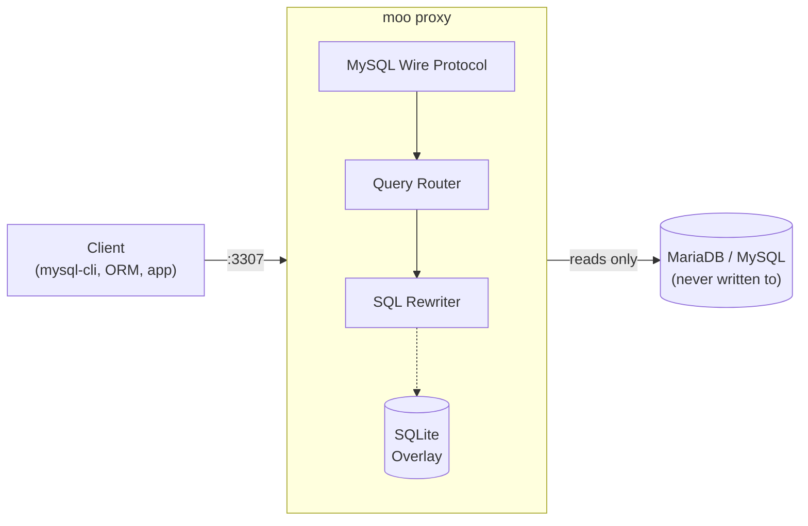
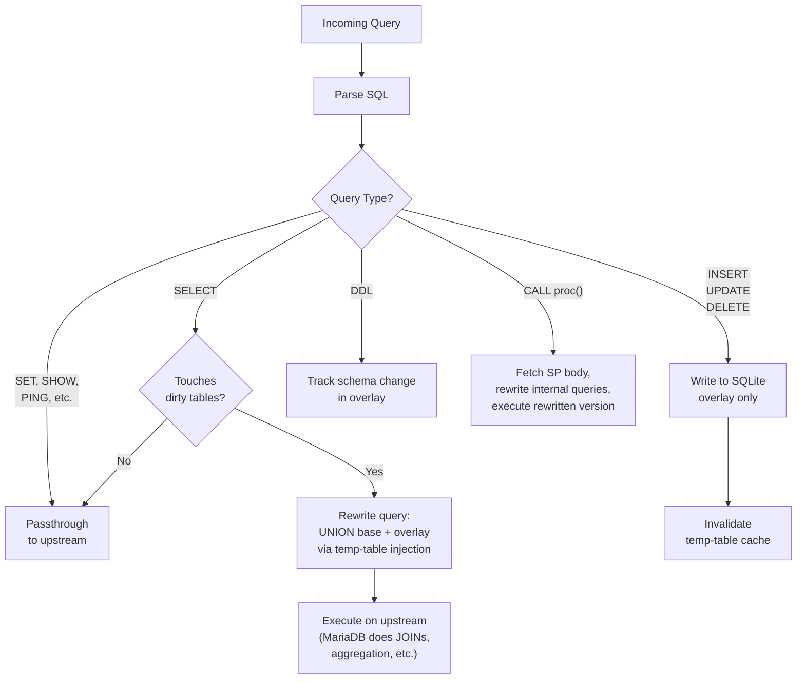
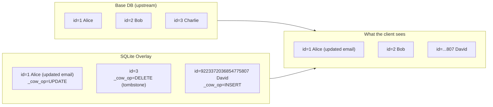
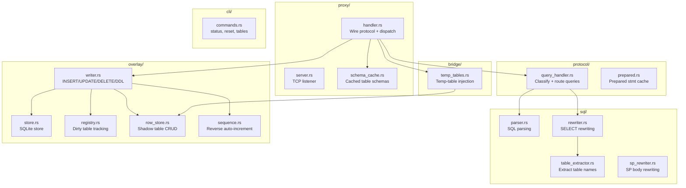
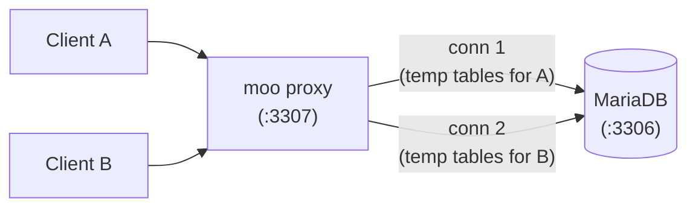

# moosql

> **Copy-on-Write proxy for MariaDB/MySQL.**
> Put it in front of any database, make changes freely — the original stays untouched.

Think **OverlayFS, but for databases**. Writes go to a local SQLite overlay. Reads merge base + overlay transparently. When you're done, throw it away.



## Why?

**Dev against production data without touching production.**

- Test schema migrations against real data
- Debug with production-like state
- Experiment freely — `moo reset` and start over
- Run integration tests against a snapshot of real data
- No database cloning, no disk space for full copies

## Quick Start

```bash
# Start the proxy (points at your real DB on :3306, listens on :3307)
moo start \
  --upstream=localhost:3306 \
  --listen=localhost:3307 \
  --user=root \
  --password=secret

# Connect through the proxy — looks exactly like your real DB
mysql -h 127.0.0.1 -P 3307 -u root mydb

# Make changes freely — they only exist in the overlay
mysql> INSERT INTO users (name) VALUES ('test-user');
mysql> ALTER TABLE orders ADD COLUMN discount DECIMAL(5,2);
mysql> DELETE FROM logs WHERE created_at < '2024-01-01';

# Your real database is completely untouched
mysql -h 127.0.0.1 -P 3306 -u root mydb -e "SELECT COUNT(*) FROM users"
# ^ same count as before

# Done experimenting? Throw it away.
moo reset
```

## How It Works



### The Overlay

All overlay data lives in SQLite — one `.db` file per database. Overlay rows use auto-increment IDs counting **down** from `2^63-1` to avoid collisions with base DB IDs counting up.

```
./dev-overlay/
  mydb.db          # overlay for "mydb"
  other_db.db      # overlay for "other_db"
```

### Row-Level Copy-on-Write



- **INSERT** — new row stored in overlay with a reverse auto-increment ID
- **UPDATE** — full row snapshot stored in overlay, shadows the base row
- **DELETE** — tombstone in overlay, base row hidden from reads
- **DDL** — schema change recorded, base schema untouched

### SELECT Rewriting

When a table has overlay data, SELECTs are rewritten to merge base + overlay:

```sql
-- Original
SELECT u.name, o.total
FROM users u JOIN orders o ON u.id = o.user_id

-- Rewritten (users has overlay data, orders doesn't)
SELECT u.name, o.total
FROM (
  SELECT * FROM users
    WHERE CAST(id AS CHAR) NOT IN (SELECT _cow_pk FROM _cow_meta_users)
  UNION ALL
  SELECT * FROM _cow_temp_users
) u
JOIN orders o ON u.id = o.user_id
```

Two session-scoped temp tables per dirty table:

| Temp Table | Contains | Purpose |
|------------|----------|---------|
| `_cow_meta_users` | All overlay PKs (inserts, updates, deletes) | `NOT IN` filter to exclude overridden base rows |
| `_cow_temp_users` | Non-tombstone data rows (inserts + updates) | `UNION ALL` to add overlay rows |

Temp tables are **cached per session** and only refreshed when overlay data changes.

## Features

| Feature | Status |
|---------|--------|
| SELECT passthrough (zero overhead for clean tables) | Done |
| INSERT / UPDATE / DELETE to overlay | Done |
| JOINs across base + overlay tables (4+ way) | Done |
| Subqueries, correlated subqueries, UNION, derived tables | Done |
| GROUP BY, HAVING, aggregates (COUNT, SUM, AVG) on dirty tables | Done |
| EXISTS / NOT EXISTS | Done |
| CASE expressions, COALESCE, IFNULL | Done |
| LIMIT / OFFSET on dirty tables | Done |
| Composite primary keys | Done |
| Self-JOINs (e.g. employee → manager) | Done |
| DDL tracking (CREATE / ALTER / DROP / TRUNCATE TABLE) | Done |
| Column DEFAULT values applied on overlay INSERT | Done |
| `LAST_INSERT_ID()` tracking | Done |
| Stored procedure body rewriting | Done |
| Prepared statement forwarding | Done |
| Per-session schema cache (one SHOW COLUMNS per table, not per query) | Done |
| Per-session temp-table cache (only rebuild after writes) | Done |
| Multi-database support (`USE db` switches overlay context) | Done |
| CLI management (`moo status`, `moo reset`, `moo tables`) | Done |
| Config file (TOML) + CLI flags (CLI wins) | Done |
| Foreign key constraint enforcement (RESTRICT, CASCADE, SET NULL) | Done |

## CLI

```bash
moo start [--upstream HOST:PORT] [--listen HOST:PORT] [--overlay PATH] \
          [--user USER] [--password PASS] [--config FILE]

moo status  [--overlay PATH]        # overlay size, dirty table count
moo tables  [--overlay PATH]        # list dirty tables with schema/data flags
moo reset   [--overlay PATH] [TABLE] # wipe overlay (all or one table)
```

### Config File

```toml
# moo.toml — all fields optional, CLI flags override

[upstream]
host = "localhost"
port = 3306
user = "root"
password = "secret"

[proxy]
listen = "localhost:3307"

[overlay]
path = "./dev-overlay/"
```

## Architecture



## Upstream Requirements

### Privileges

The proxy user needs more than `SELECT` — it creates temporary tables in the upstream session:

```sql
GRANT SELECT, CREATE TEMPORARY TABLES ON mydb.* TO 'moo_user'@'%';
```

| Privilege | Why |
|-----------|-----|
| `SELECT` | Read base data, execute rewritten queries |
| `CREATE TEMPORARY TABLES` | Inject overlay rows for JOINs via session-scoped temp tables |

No `INSERT`, `UPDATE`, `DELETE`, or DDL privileges on real tables are needed. The proxy never writes to the upstream.

### Connection Model



- **1:1 mapping**: each client connection gets its own upstream connection
- **No connection pooling**: temp tables are session-scoped and must persist for the lifetime of the client connection
- When a client disconnects, the upstream connection is closed and MariaDB automatically drops all temp tables
- No manual cleanup needed

### Multiple Instances

Multiple `moo` instances can safely point at the same upstream database. Temp tables are **session-scoped** in MariaDB — each upstream connection has its own namespace. Instance A's `_cow_temp_users` is invisible to instance B.

```bash
# Both share the same upstream — no conflicts
moo start --upstream=db:3306 --listen=:3307 --overlay=./overlay-alice
moo start --upstream=db:3306 --listen=:3308 --overlay=./overlay-bob
```

Each instance has its own SQLite overlay directory, so overlay data is isolated per instance.

## Known Limitations

- **No commit-back** — overlay changes cannot be merged into the base database (by design)
- **No `LOAD DATA INFILE`** — not intercepted
- **No replication support** — proxy is not a replication slave
- **Prepared statements on dirty tables** read stale base data (v1 — rewriting at PREPARE time planned)
- **Complex SPs** with cursors, dynamic SQL, or nested calls may not rewrite correctly
- **Foreign key UPDATE constraints** (when a PK value changes) are not yet enforced
- **No connection pooling (yet)** — each client gets a dedicated upstream connection for temp table isolation. A pooled mode is planned where temp tables are rebuilt on checkout and cleaned up on checkin.

## Building

```bash
cargo build --release
# Binary: target/release/moo
```

Requires Rust 1.70+. SQLite is bundled (no system dependency needed).

## Tech Stack

| Crate | Purpose |
|-------|---------|
| [opensrv-mysql](https://crates.io/crates/opensrv-mysql) | MySQL wire protocol server |
| [sqlparser-rs](https://crates.io/crates/sqlparser) | SQL parsing (MySQL dialect) |
| [rusqlite](https://crates.io/crates/rusqlite) | SQLite (bundled) |
| [mysql_async](https://crates.io/crates/mysql_async) | Upstream MariaDB/MySQL client |
| [tokio](https://crates.io/crates/tokio) | Async runtime |

## License

MIT
